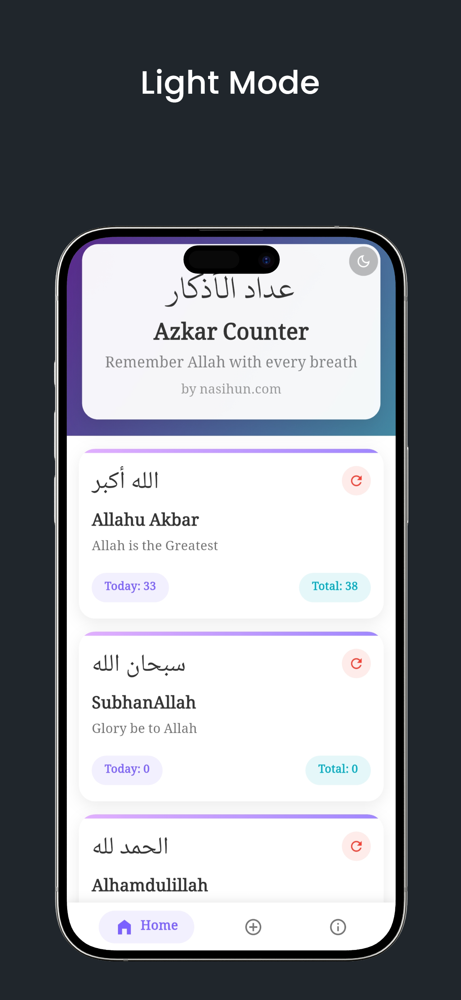
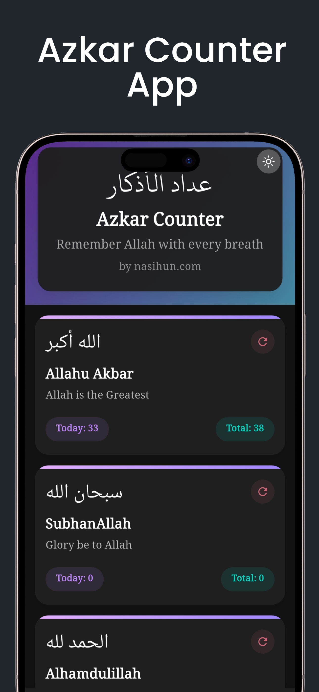
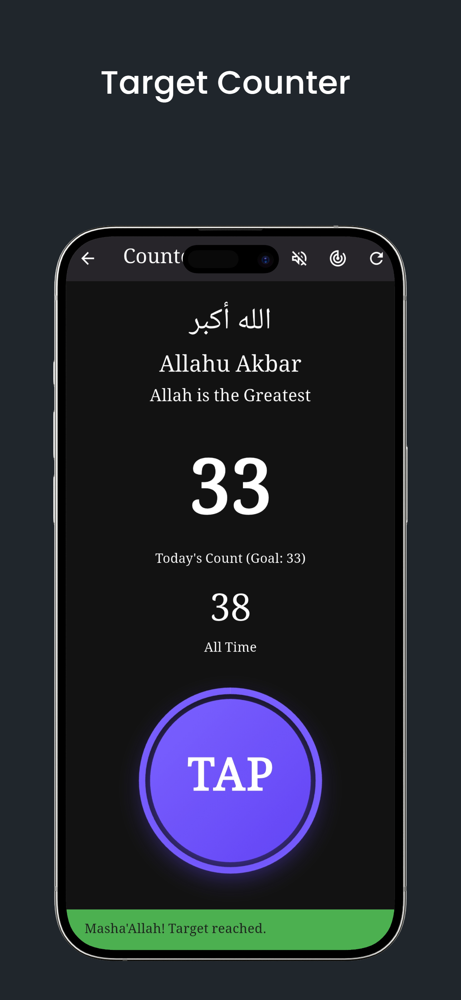
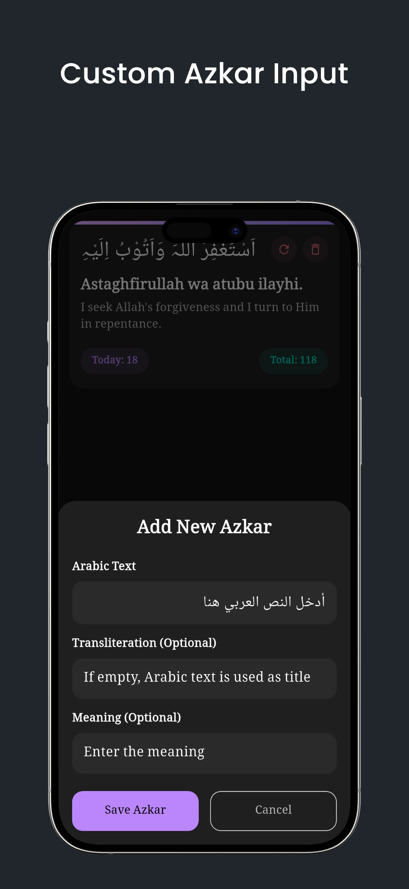

# 📿 Azkar Counter - Digital Tasbeeh App


**Azkar Counter** is a beautiful, simple, and modern digital Tasbeeh and Zikr (Dhikr) counter app built with **Flutter**. Designed for the mindful Muslim, it offers an ad-free, privacy-focused, and distraction-free experience to help you in your daily remembrance of Allah (SWT).

This repository contains the complete open-source code of the Azkar Counter app.

---

## ✨ Key Features

- **Elegant Digital Tasbeeh**  
  A minimal, peaceful, and distraction-free counter interface.

- **Default & Custom Azkar**  
  Pre-loaded with daily Azkar and allows users to add, edit, and delete their personal duas.

- **Target Counter**  
  Set Zikr goals (e.g., 33, 100). Get visual progress and alerts on completion.

- **Progress Tracking**  
  Track today's count (auto-resets daily) and total count to monitor consistency.

- **Light & Dark Modes**  
  System-aware themes or toggle manually for optimal visual comfort.

- **Haptic & Sound Feedback**  
  - Gentle vibration per tap  
  - Distinct vibration/sound on target completion  
  - Toggle sounds on/off in settings

- **100% Private & Offline**  
  Data is stored locally using **Hive** — no internet, no tracking, no ads.

- **Modern Tech Stack**  
  Built with **Flutter**, using **Provider** for state management and **Hive** for local storage.

---

## 📸 Screenshots

<p align="center">
  
  
  
  
</p>

---

## 🚀 Getting Started

This project is a Flutter-based mobile app for Android and iOS.

### Prerequisites

- [Flutter SDK](https://flutter.dev/docs/get-started/install)
- Android Studio or Visual Studio Code

### Installation

```bash
git clone https://github.com/your-username/azkar-counter.git
cd azkar-counter
flutter pub get
flutter pub run build_runner build --delete-conflicting-outputs
flutter run


## 🛠️ Built With

- **[Flutter](https://flutter.dev)** – A modern UI toolkit for building beautiful, natively compiled apps for mobile, web, and desktop from a single codebase.
- **[Provider](https://pub.dev/packages/provider)** – A simple and scalable state management solution.
- **[Hive](https://pub.dev/packages/hive)** – A lightweight and blazing-fast key-value database written in Dart, perfect for local offline storage.
- **[url_launcher](https://pub.dev/packages/url_launcher)** – Used to launch URLs in the mobile platform.
- **[vibration](https://pub.dev/packages/vibration)** – Enables haptic feedback for a more interactive experience.
- **[audioplayers](https://pub.dev/packages/audioplayers)** – Plays sound notifications on user interaction.

---

## 🤝 Contributing

Contributions are what make the open-source community such a wonderful place to learn, inspire, and create. Any contributions you make are **greatly appreciated**.

### How to Contribute

1. **Fork** the repository
2. **Create your feature branch**  
   ```bash
   git checkout -b feature/YourFeatureName
3. **Commit your changes**
    ```bash
    git commit -m "Add Your Feature"
4. **Push to the branch**
    ```bash
    git push origin feature/YourFeatureName
5. Open a pull request

Alternatively, you can open an issue with the enhancement or bug label.

---

## 📄 License

Distributed under the **MIT License**.  
See the [LICENSE](LICENSE) file for more details.

---

## 📧 Contact

**Nasihun**  
- Email: [thenasihun@gmail.com](mailto:thenasihun@gmail.com)  
- GitHub: [@thenasihun](https://github.com/thenasihun)  
- Project Link: [https://github.com/your-username/azkar-counter](https://github.com/thenasihun/azkar-counter-app)

---

> _“فَاذْكُرُونِي أَذْكُرْكُمْ”_  
> _So remember Me; I will remember you._  
> — **Surah Al-Baqarah (2:152)**
